# Government Support for Accessibility to Higher Education Among Underrepresented Groups in Massachusetts
## Assignment 01 Heuristic Evaluation | Crystal Huynh, DH 110 F2021 

### Summary: 

Higher education and the academia aesthetic have been glamourized in today's digital age with people posting on Youtube and TikTok about their college experiences at world renowned institutions or Hogwarts-like lifetsyle, but a major issue that is currently being tackled in this realm is the exclusivity of higher education. In both reality and the portrayal of higher education in media, higher education is dominated by white males, especially at institutions like the Ivy Leagues. With this project, I want to explore what is being done at the government level to support the diversity and inclusion of underrepresented groups, focusing specifically on Massachusetts, home to the most well known Ivy League, Harvard University. How is affirmative action being implemented and is it truly helping marginalized groups? How are all schools in the New England state, not just the prestigious Harvard, pledging to make higher aducation more accessible to all? These are just some of the questions I hope to explore and answer in this project.

### [Jakob Nielson's 10 Usability Heuristics Explained](https://www.nngroup.com/articles/ten-usability-heuristics/)
|Number|Heuristic|Definition|
|---|---|---|
|1|Visibility of System Status|The design should always keep users informed about what is going on, through appropriate feedback within a reasonable amount of time.|
|2|Match Between System and the Real World|The design should speak the users' language. Use words, phrases, and concepts familiar to the user, rather than internal jargon. Follow real-world conventions, making information appear in a natural and logical order.|
|3|User Control and Freedom|Users often perform actions by mistake. They need a clearly marked "emergency exit" to leave the unwanted action without having to go through an extended process.|
|4|Consistency and standards|Users should not have to wonder whether different words, situations, or actions mean the same thing. Follow platform and industry conventions.|
|5|Error prevention|Good error messages are important, but the best designs carefully prevent problems from occurring in the first place. Either eliminate error-prone conditions, or check for them and present users with a confirmation option before they commit to the action.|
|6|Recognition rather than recall|Minimize the user's memory load by making elements, actions, and options visible. The user should not have to remember information from one part of the interface to another. Information required to use the design (e.g. field labels or menu items) should be visible or easily retrievable when needed.|
|7|Flexibility and efficiency of use|Shortcuts — hidden from novice users — may speed up the interaction for the expert user such that the design can cater to both inexperienced and experienced users. Allow users to tailor frequent actions.|
|8|Aesthetic and minimalist design|Interfaces should not contain information which is irrelevant or rarely needed. Every extra unit of information in an interface competes with the relevant units of information and diminishes their relative visibility.|
|9|Help users recognize, diagnose, and recover from errors|Error messages should be expressed in plain language (no error codes), precisely indicate the problem, and constructively suggest a solution.|
|10|Help and documentation|It’s best if the system doesn’t need any additional explanation. However, it may be necessary to provide documentation to help users understand how to complete their tasks.|

### [Severity Ratings for Usability Problems by Nielsen Norman Group](https://www.nngroup.com/articles/how-to-rate-the-severity-of-usability-problems/)
|Rating|Description|
|---|---|
|1|Cosmetic problem only: need not be fixed unless extra time is available on project|
|2|Minor usability problem: fixing this should be given low priority|
|3|Major usability problem: important to fix, so should be given high priority|

## Website 1: [Massachusetts Department of Higher Education](https://www.mass.edu/home.asp)

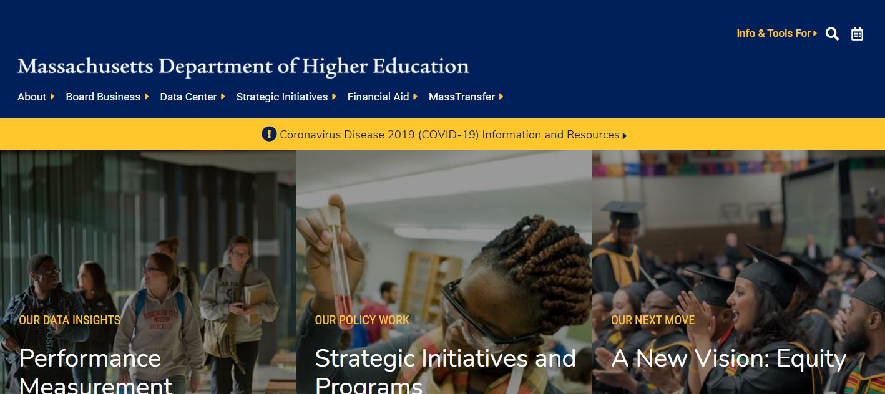

### About

The Massachusetts Department of Education works to ensure that all residents in Massachusetts have access to higher education and are given the opportunity to benefit from it. The Board of Higher Education creates and maintains a system of public higher education so that programs and services meet the standards required to truly be valuable for people of all backgrounds. In 2018, the Board and Department of Higher Education partnered with public higher education institutions to develop a statewide plan focused on equity in hopes that "the Massachusetts system of public higher education will enhance economic and social mobility for all citizens, but particularly for those that have historically been underserved and underrepresented, especially students of color, throughout all levels of education."

There are a lot of great resources and information about higher education on the Massachusetts Department of Education's website, and I hope to help feature it all through improvement reccomendations for users to easily find and access those resources.

### Heuristic Evaluation

#### 1. Visibility of System Status

* Since the search bar is "enhanced by Google", as users type in a word, the possible options shown are their past Google searches rather than the website's most frequently searched terms. Users can see options that have no correlation to higher education, the Department, or Massachusetts which does not help the users when using this feature for more relevant topics. **(2)**

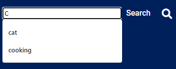

> Recommendation: Optimize search results so users can be guided to the most relevant and frequently searched information/resources on the site. The site could show the most searched terms before the users begin typing and then adjust/filter the possible options as the user types.

* As the user navigates the site, there are some links that take a user to a totally different section of the site when they expect to stay in the same section as documented in the breadcrumb navigation feature. This may confuse users with where they are in the site. If the user misclicked, it is difficult to navigate back to where they were without using the browser's back button instead of using the breadcrumb feature. **(3)**

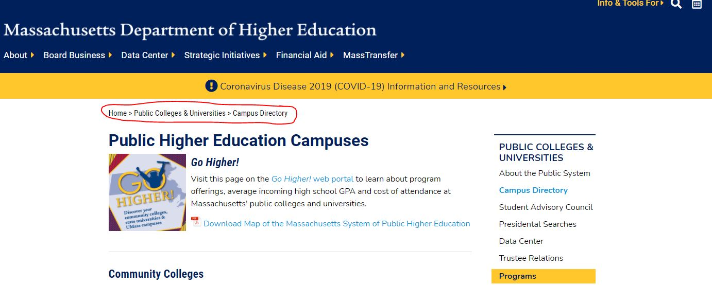

versus

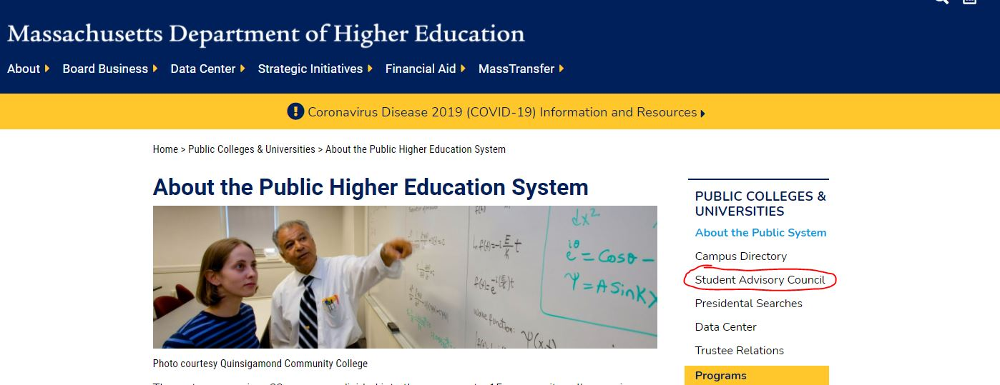
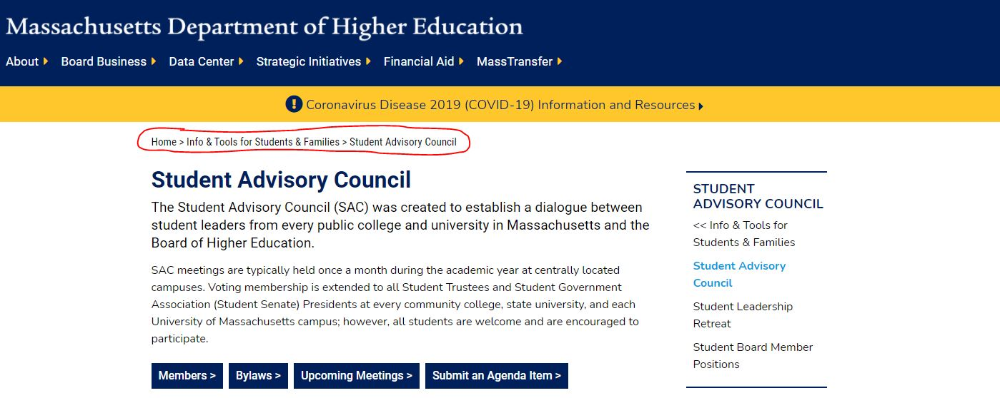

> Recommendation: Even if there are multiple ways for a user to get to a certain page, have the breadcrumb navigation feature reflect the steps the user took to reach a page so they know where they are and how to get back to the previous page if needed.

#### 2. Match Between System and the Real World

* For the top navigation bar, each tab has a right facing arrow which when the user hovers over, a drop down with more options appears. With the opened tab, the arow changes to be down facing. The right facing arrow would usually indicate the direction more options would appear from, so it feels unnatural that with a right facing arrow, the options drop down instead of sliding out to the right which users would expect. **(1)**

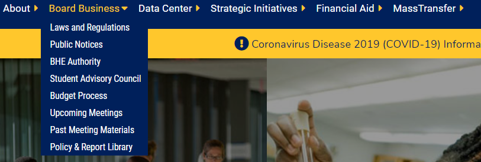

> Recommendation: Have the arrows face downwards to indicate there are more options under that tab in a drop down. When the user hovers over the tab, have the arrows point upward as a visual indicator to "close" the drop down.

* Another note about the tabs is that all the tabs have those arrows, but some of the tabs do not have a drop down with more options when the user hovers over it. An arrow indicates more options, and it is confusing for users to recognize what the arrow typically means in a navigation bar but not see what they would expect. **(1)**

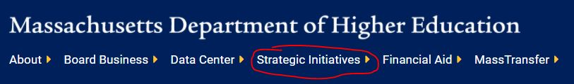

> Recommendation: Remove the arrows from the tabs that do not have a drop down with more options.

* In terms of featured content, the site organizes content with featured content scattered around the page. The main indication that a piece of content is featured is with a red featured tag over the thumbnail image. Featured content is usually takes up more space and is placed at the top of the page or section to catch the user's attention and keep them engaged. **(1)**  

1{featured](featured.JPG)

> Recommendation: Place all featured content towards the top of the page or section for users to easily find and access.

#### 3. User Control and Freedom

* When using the search bar, the searched term is not saved in the search bar. If the user mistyped, they are not able to easily fix their typo because they would have to retype their search term. The search bar also collapses once the user searches their term, adding an extra step to fix their mistake if they made one. **(2)**

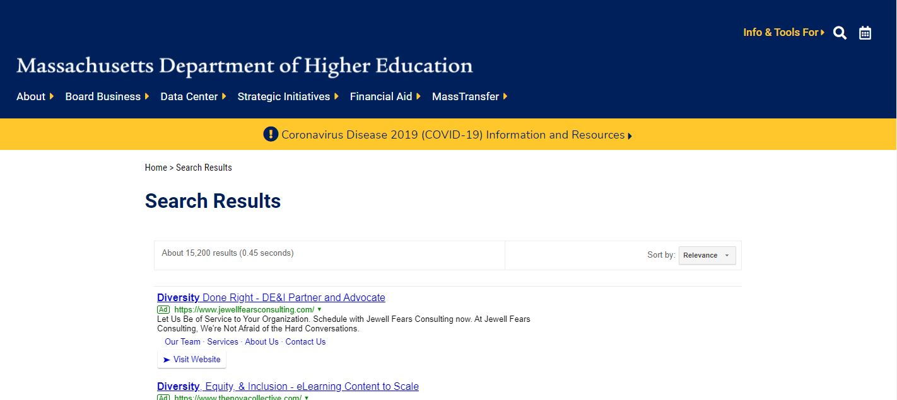

> Recommendation: Once the user presses enter to search their term, the site should keep their term in an open search bar. If the user made a typo, they can easily fix their mistake and research the term.

#### 4. Consistency and Standards

* Some of the tabs in the navigation bar take the user to what seems to be a completely different website. If that page is supposed to be a part of the main website, the different design is confusing to users. **(3)**

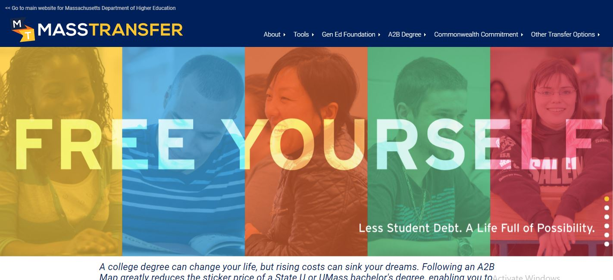

versus

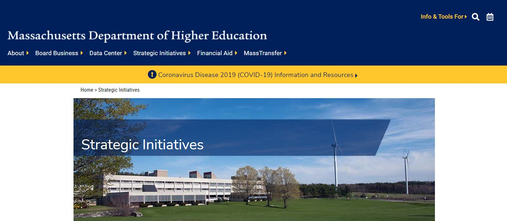

> Recommendations: Maintain consistency in the web page design so that each web page is visually linked to the main site. This will help users recognize that they are still exmploring the same site.

* There are some pages where there is a hover animation applied to the content, indicating the content is clickable and will take the user to another page. Other pages on the site do not have this animation applied to their content. **(1)**

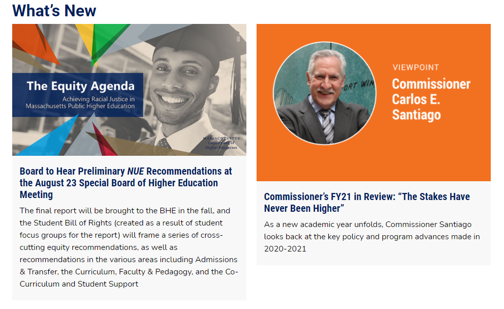

> Recommendation: Either choose to apply the hover animation on all the pages or not have the animation at all to keep the consistency across the site.

* There is also an "Info and Tools For" section that when clicked, slides out to show more options next to the search icon. This looks like something that should be a part of the navigation bar as there is additional content linked. "Info and Tools For" is also a vague term that would not help users much when trying to navigate the contents of the site. **(2)**

> Recommendation: Move "Info and Tools For" to the navigation bar and rename the text so it is less vague.

#### 5. Error Prevention

* When using the filter feature for searching through initiatives, it is difficult for the user to see everything they selected since the scroll section does not show all the selection options at once. The user could have mistakenly selected an option or missed selecting an option, and they may not be aware of it as the scroll section shows six options at a time. **(2)**

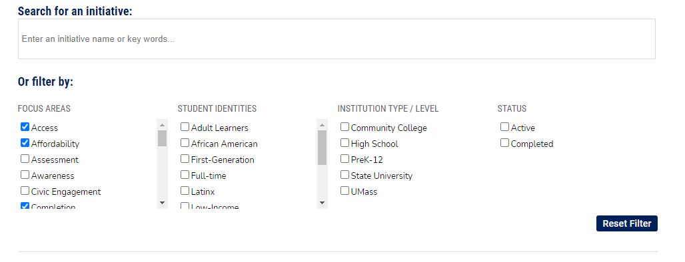

> Recommendation: Have the selected options appear at the top or bottom of the filter section like tags so the user can see what they selected in once place in case they accidentally clicked on an option they did not want.

#### 6. Recognition Rather Than Recall

* Although the site does have the breadcrumb navigation feature, a small detail that would help users recognize the page they are on would be if the tab they clicked on from the navigation bar was highlighted. The tab text does change color when the user hovers over it, but that color change is lost once the user clicks on the tab. Once the user is taken to the respective page, the navigation bar tab text return to being all white, as if they were not clicked on. So, there is no indication on the navigation bar that the user clicked on a tab and is on that respective page. **(1)**

> Recommendation: Keep the color change as a highlighted indication that the user is on that respective web page. Since the navigation bar text is bigger than the breadcrumb text, visually the user will more easily recognize where they are in the site.

#### 7. Flexibility and Efficiency of Use

* Since the site has a navigation bar at the top of the site, it can get overwhelming for the user to click on a tab and see even more options on the side navigation, especially when some of the options on the side navigation do not show up in a drop down of the top navigation bar. **(3)**

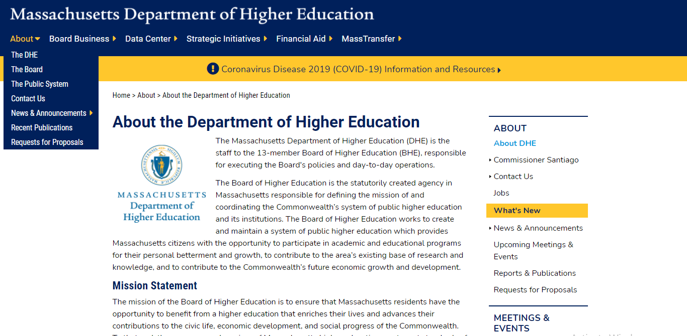

> Recommendation: Organize the top navigation bar content so that the user can see all the page options under a tab at once. Design the side navigation for those pages to reflect the position of the user in the website.

* Since the "search" button looks more like text next to the search bar, users may not realize that it is actually a clickable button unless they hover over the text. **(1)**

> Recommendation: Design a typical "search" button with a CTA color for users to recognize that it is a button to use for the search feature rather than descriptive text.

#### 8. Aesthetic and Minimalist Design

* There are some lists of links on the site where the font size for the links are incredible small, making it not only inconsistent throughout the site design, but also hard to read. **(3)**

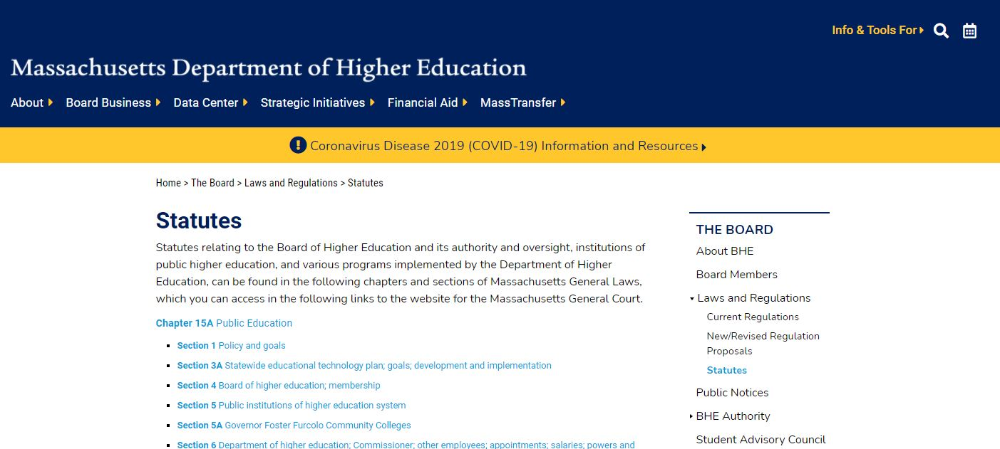

> Recommendation: Standardize the link font size so they are at a readable size for the user to easily use.

#### 9. Help Users Recognize, Diagnose, and Recover From Errors

* On the DACA page, there is a video embadded in the web page that is "unavailable" with no external link or title of the video stated anywhere on the page. There is just the description of the video below the embed which is a bit too vague for the user to use to try and search up the video on their own. If the user is a DACA student, they may be missing important information from the video. **(3)**

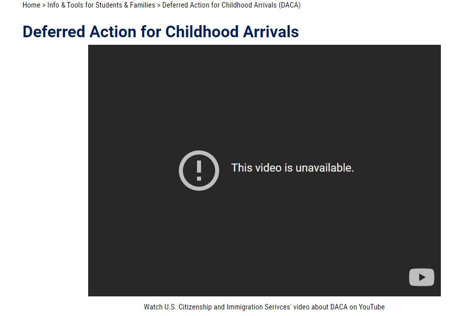

> Recommendation: Either remove the video embed, replace it with a different video with similar information, or replace the video with a summary of the information from the video.

#### 10. Help and Documentation

* If the user wishes to contact a staff member, they must use the Staff Directory page. Although there is a filter feature, all of the staff members' contact information is not organized into sections/categories and instead placed in a long list in alphabetical order by last name as the default. **(1)**
insert photo

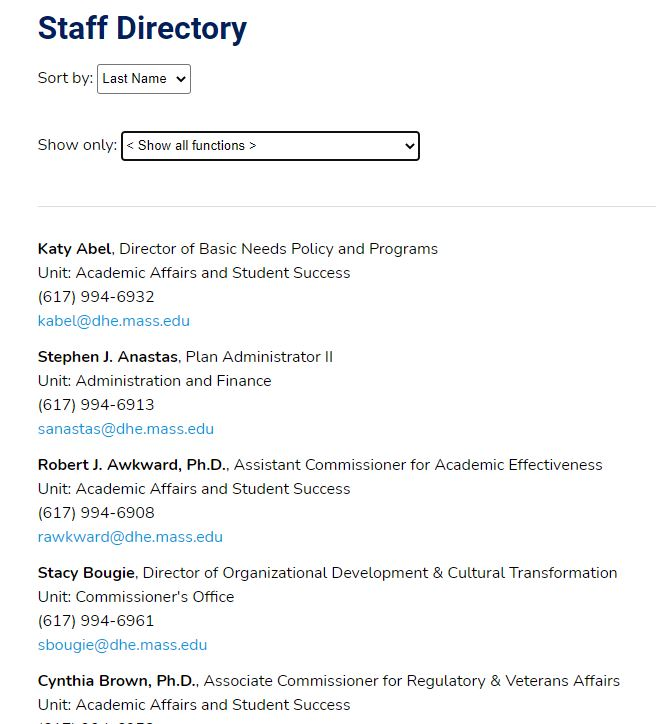

> Recommendation: Have the default be organizing the staff members by unit/department first and then within the unit/department by last name alphabetically to make the list more organized at first glance.

### Overall Assessment
The Massachusetts Department of Education website overall has a design that is simple, but the organization can be improved through small design details to better support the content and resources it features. The site hosts a lot of information and the site's design makes it feel that way to the user rather than making it seem easy and seemless to navigate through it all. One of the main design improvements the site needs to focus on is consistency. 

## Website 2: [Massachusetts Coalition for Adult Education](https://mcae.net/)

### About

blah blah blah insert text

### Heuristic Evaluation

#### 1. Visibility of System Status

* point 1

#### 2. Match Between System and the Real World

* point 1

#### 3. User Control and Freedom

* point 1

#### 4. Consistency and Standards

* point 1

#### 5. Error Prevention

* point 1

#### 6. Recognition Rather Than Recall

* point 1

#### 7. Flexibility and Efficiency of Use

* point 1

#### 8. Aesthetic and Minimalist Design

* point 1

#### 9. Help Users Recognize, Diagnose, and Recover From Errors

* point 1

#### 10. Help and Documentation

* point 1
