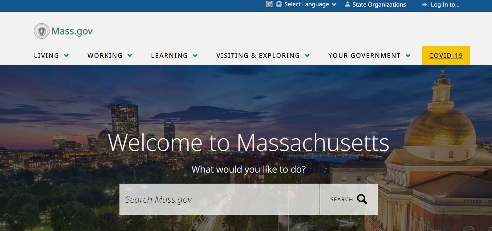

# Government Support for Accessibility to Higher Education Among Underrepresented Groups in Massachusetts
## Assignment 01 Heuristic Evaluation | Crystal Huynh, DH 110 F2021 

#### Summary: 

Higher education and the academia aesthetic have been glamourized in today's digital age with people posting on Youtube and TikTok about their college experiences at world renowned institutions or Hogwarts-like lifetsyle, but a major issue that is currently being tackled in this realm is the exclusivity of higher education. In both reality and the portrayal of higher education in media, higher education is dominated by white males, especially at institutions like the Ivy Leagues. With this project, I want to explore what is being done at the government level to support the diversity and inclusion of underrepresented groups, focusing specifically on Massachusetts, home to the most well known Ivy League, Harvard University. How is affirmative action being implemented and is it truly helping marginalized groups? How are all schools in the New England state, not just the prestigious Harvard, pledging to make higher aducation more accessible to all? These are just some of the questions I hope to explore and answer in this project.

### [Jakob Nielson's 10 Usability Heuristics Explained](https://www.nngroup.com/articles/ten-usability-heuristics/)
|Number|Heuristic|Definition|
|---|---|---|
|1|Visibility of System Status|The design should always keep users informed about what is going on, through appropriate feedback within a reasonable amount of time.|
|2|Match Between System and the Real World|The design should speak the users' language. Use words, phrases, and concepts familiar to the user, rather than internal jargon. Follow real-world conventions, making information appear in a natural and logical order.|
|3|User Control and Freedom|Users often perform actions by mistake. They need a clearly marked "emergency exit" to leave the unwanted action without having to go through an extended process.|
|4|Consistency and standards|Users should not have to wonder whether different words, situations, or actions mean the same thing. Follow platform and industry conventions.|
|5|Error prevention|Good error messages are important, but the best designs carefully prevent problems from occurring in the first place. Either eliminate error-prone conditions, or check for them and present users with a confirmation option before they commit to the action.|
|6|Recognition rather than recall|Minimize the user's memory load by making elements, actions, and options visible. The user should not have to remember information from one part of the interface to another. Information required to use the design (e.g. field labels or menu items) should be visible or easily retrievable when needed.|
|7|Flexibility and efficiency of use|Shortcuts — hidden from novice users — may speed up the interaction for the expert user such that the design can cater to both inexperienced and experienced users. Allow users to tailor frequent actions.|
|8|Aesthetic and minimalist design|Interfaces should not contain information which is irrelevant or rarely needed. Every extra unit of information in an interface competes with the relevant units of information and diminishes their relative visibility.|
|9|Help users recognize, diagnose, and recover from errors|Error messages should be expressed in plain language (no error codes), precisely indicate the problem, and constructively suggest a solution.|
|10|Help and documentation|It’s best if the system doesn’t need any additional explanation. However, it may be necessary to provide documentation to help users understand how to complete their tasks.|

### [Severity Ratings for Usability Problems by Nielsen Norman Group](https://www.nngroup.com/articles/how-to-rate-the-severity-of-usability-problems/)
|Rating|Description|
|---|---|
|1|Cosmetic problem only: need not be fixed unless extra time is available on project|
|2|Minor usability problem: fixing this should be given low priority|
|3|Major usability problem: important to fix, so should be given high priority|

## Website 1: 

https://www.mass.gov/

