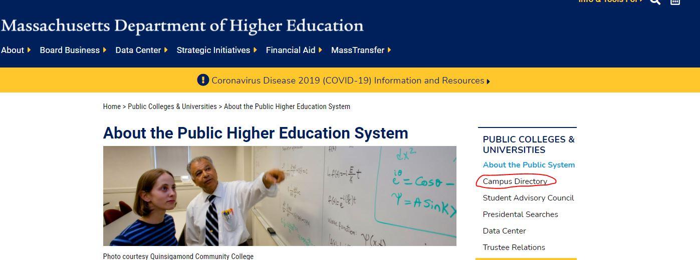
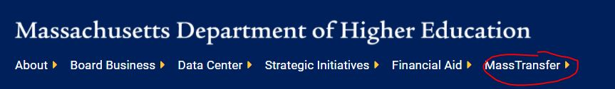
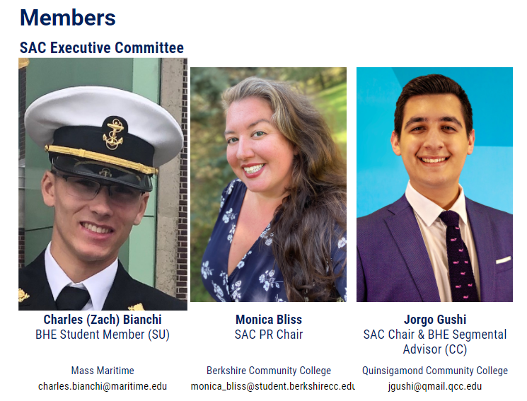

# Government Support for Accessibility to Higher Education Among Underrepresented Groups in Massachusetts
## Assignment 01 Heuristic Evaluation | Crystal Huynh, DH 110 F2021 

### Summary: 

Higher education and the academia aesthetic have been glamourized in today's digital age with people posting on Youtube and TikTok about their college experiences at world renowned institutions or Hogwarts-like lifetsyle, but a major issue that is currently being tackled in this realm is the exclusivity of higher education. In both reality and the portrayal of higher education in media, higher education is dominated by white males, especially at institutions like the Ivy Leagues. With this project, I want to explore what is being done at the government level to support the diversity and inclusion of underrepresented groups, focusing specifically on Massachusetts, home to the most well known Ivy League, Harvard University. How is affirmative action being implemented and is it truly helping marginalized groups? How are all schools in the New England state, not just the prestigious Harvard, pledging to make higher aducation more accessible to all? These are just some of the questions I hope to explore and answer in this project.

### [Jakob Nielson's 10 Usability Heuristics Explained](https://www.nngroup.com/articles/ten-usability-heuristics/)
|Number|Heuristic|Definition|
|---|---|---|
|1|Visibility of System Status|Users should always know what is going on and be given guided feedback for their actions.|
|2|Match Between System and the Real World|The design should use ideas and language that the user recognizes.|
|3|User Control and Freedom|The design should allow users to undo or redo an action if they made a mistake.|
|4|Consistency and standards|The design should be consistent and follow platform and industry conventions.|
|5|Error prevention|The design should take into consideration possible error-prone conditions and try to prevent them.|
|6|Recognition rather than recall|Use designs that provide suggestions and context for the users to minimize the amount they need to remember.|
|7|Flexibility and efficiency of use|The design should allow for multiple pathways to the same location or action.|
|8|Aesthetic and minimalist design|The design should showcase relevant content and features.|
|9|Help users recognize, diagnose, and recover from errors|Error messages should clearly communicate to the user what the issue is and how to fix it.|
|10|Help and documentation|The design should provide users extra help when they need it.|

### [Severity Ratings for Usability Problems by Nielsen Norman Group](https://www.nngroup.com/articles/how-to-rate-the-severity-of-usability-problems/)
|Rating|Description|
|---|---|
|1|Cosmetic problem only: need not be fixed unless extra time is available on project|
|2|Minor usability problem: fixing this should be given low priority|
|3|Major usability problem: important to fix, so should be given high priority|

## Website 1: [Massachusetts Department of Higher Education](https://www.mass.edu/home.asp)

### About

The Massachusetts Department of Education works to ensure that all residents in Massachusetts have access to higher education and are given the opportunity to benefit from it. The Board of Higher Education creates and maintains a system of public higher education so that programs and services meet the standards required to truly be valuable for people of all backgrounds. In 2018, the Board and Department of Higher Education partnered with public higher education institutions to develop a statewide plan focused on equity in hopes that "the Massachusetts system of public higher education will enhance economic and social mobility for all citizens, but particularly for those that have historically been underserved and underrepresented, especially students of color, throughout all levels of education."

There are a lot of great resources and information about higher education on the Massachusetts Department of Education's website, and I hope to help feature it all through improvement reccomendations for users to easily find and access those resources.

### Heuristic Evaluation

#### 1. Visibility of System Status

* Since the search bar is "enhanced by Google", as users type in a word, the possible options shown are their past Google searches rather than the website's most frequently searched terms. Users can see options that have no correlation to higher education, the Department, or Massachusetts which does not help the users when using this feature for more relevant topics. **(2)**

> Recommendation: Optimize search results so users can be guided to the most relevant and frequently searched information/resources on the site. The site could show the most searched terms before the users begin typing and then adjust/filter the possible options as the user types.

* As the user navigates the site, there are some links that take a user to a totally different section of the site when they expect to stay in the same section as documented in the breadcrumb navigation feature. This may confuse users with where they are in the site. If the user misclicked, it is difficult to navigate back to where they were without using the browser's back button instead of using the breadcrumb feature. **(3)**

versus

> Recommendation: Even if there are multiple ways for a user to get to a certain page, have the breadcrumb navigation feature reflect the steps the user took to reach a page so they know where they are and how to get back to the previous page if needed.

#### 2. Match Between System and the Real World

* For the top navigation bar, each tab has a right facing arrow which when the user hovers over, a drop down with more options appears. With the opened tab, the arow changes to be down facing. The right facing arrow would usually indicate the direction more options would appear from, so it feels unnatural that with a right facing arrow, the options drop down instead of sliding out to the right which users would expect. **(1)**

> Recommendation: Have the arrows face downwards to indicate there are more options under that tab in a drop down. When the user hovers over the tab, have the arrows point upward as a visual indicator to "close" the drop down.

* Another note about the tabs is that all the tabs have those arrows, but some of the tabs do not have a drop down with more options when the user hovers over it. An arrow indicates more options, and it is confusing for users to recognize what the arrow typically means in a navigation bar but not see what they would expect. **(1)**

> Recommendation: Remove the arrows from the tabs that do not have a drop down with more options.

* In terms of featured content, the site organizes content with featured content scattered around the page. The main indication that a piece of content is featured is with a red featured tag over the thumbnail image. Featured content is usually takes up more space and is placed at the top of the page or section to catch the user's attention and keep them engaged. **(1)**  

1{featured](featured.JPG)

> Recommendation: Place all featured content towards the top of the page or section for users to easily find and access.

#### 3. User Control and Freedom

* When using the search bar, the searched term is not saved in the search bar. If the user mistyped, they are not able to easily fix their typo because they would have to retype their search term. The search bar also collapses once the user searches their term, adding an extra step to fix their mistake if they made one. **(2)**

> Recommendation: Once the user presses enter to search their term, the site should keep their term in an open search bar. If the user made a typo, they can easily fix their mistake and research the term.

#### 4. Consistency and Standards

* Some of the tabs in the navigation bar take the user to what seems to be a completely different website. If that page is supposed to be a part of the main website, the different design is confusing to users. **(3)**

versus

> Recommendations: Maintain consistency in the web page design so that each web page is visually linked to the main site. This will help users recognize that they are still exmploring the same site.

* There are some pages where there is a hover animation applied to the content, indicating the content is clickable and will take the user to another page. Other pages on the site do not have this animation applied to their content. **(1)**

versus

> Recommendation: Either choose to apply the hover animation on all the pages or not have the animation at all to keep the consistency across the site.

* There is also an "Info and Tools For" section that when clicked, slides out to show more options next to the search icon. This looks like something that should be a part of the navigation bar as there is additional content linked. "Info and Tools For" is also a vague term that would not help users much when trying to navigate the contents of the site. **(2)**

> Recommendation: Move "Info and Tools For" to the navigation bar and rename the text so it is less vague.

#### 5. Error Prevention

* When using the filter feature for searching through initiatives, it is difficult for the user to see everything they selected since the scroll section does not show all the selection options at once. The user could have mistakenly selected an option or missed selecting an option, and they may not be aware of it as the scroll section shows six options at a time. **(2)**

> Recommendation: Have the selected options appear at the top or bottom of the filter section like tags so the user can see what they selected in once place in case they accidentally clicked on an option they did not want.

#### 6. Recognition Rather Than Recall

* Although the site does have the breadcrumb navigation feature, a small detail that would help users recognize the page they are on would be if the tab they clicked on from the navigation bar was highlighted. The tab text does change color when the user hovers over it, but that color change is lost once the user clicks on the tab. Once the user is taken to the respective page, the navigation bar tab text return to being all white, as if they were not clicked on. So, there is no indication on the navigation bar that the user clicked on a tab and is on that respective page. **(1)**

> Recommendation: Keep the color change as a highlighted indication that the user is on that respective web page. Since the navigation bar text is bigger than the breadcrumb text, visually the user will more easily recognize where they are in the site.

#### 7. Flexibility and Efficiency of Use

* Since the site has a navigation bar at the top of the site, it can get overwhelming for the user to click on a tab and see even more options on the side navigation, especially when some of the options on the side navigation do not show up in a drop down of the top navigation bar. **(3)**

> Recommendation: Organize the top navigation bar content so that the user can see all the page options under a tab at once. Design the side navigation for those pages to reflect the position of the user in the website.

* Since the "search" button looks more like text next to the search bar, users may not realize that it is actually a clickable button unless they hover over the text. **(1)**

> Recommendation: Design a typical "search" button with a CTA color for users to recognize that it is a button to use for the search feature rather than descriptive text.

#### 8. Aesthetic and Minimalist Design

* There are some lists of links on the site where the font size for the links are incredible small, making it not only inconsistent throughout the site design, but also hard to read. **(3)**

> Recommendation: Standardize the link font size so they are at a readable size for the user to easily use.

#### 9. Help Users Recognize, Diagnose, and Recover From Errors

* On the DACA page, there is a video embadded in the web page that is "unavailable" with no external link or title of the video stated anywhere on the page. There is just the description of the video below the embed which is a bit too vague for the user to use to try and search up the video on their own. If the user is a DACA student, they may be missing important information from the video. **(3)**

> Recommendation: Either remove the video embed, replace it with a different video with similar information, or replace the video with a summary of the information from the video.

#### 10. Help and Documentation

* If the user wishes to contact a staff member, they must use the Staff Directory page. Although there is a filter feature, all of the staff members' contact information is not organized into sections/categories and instead placed in an overwhelming long list in alphabetical order by last name as the default. **(1)**
insert photo

> Recommendation: Have the default be organizing the staff members by unit/department first and then within the unit/department by last name alphabetically to make the list more organized at first glance.

### Overall Assessment

The Massachusetts Department of Education website overall has a design that is simple, but the organization can be improved through small design details to better support the content and resources it features. The site hosts a lot of information and the site's design makes it feel that way to the user rather than making it seem easy and seemless to navigate through it all. One of the main design improvements the site needs to focus on is consistency. 

## Website 2: [Executive Office of Education](https://www.mass.gov/orgs/executive-office-of-education)

### About

Massachusetts's Executive Office of Education works to create educational opportunities for all Massachusetts residents. From strengthening educational reform to improving college affordability, the EOE hopes to connect educational programs and policies across the entire state public education system. The EOE partners with the Department of Early Education and Care, Department of Elementary and Secondary Education, Department of Higher Education, and the Massachusetts's public colleges and universities to support students of all grade levels.

Although the EOE site is a part of the Massachusetts's government site, I want to ensure the design of this section is still functional and accessible to users. Can users navigate to the EOE section of the government site easily? In the EOE section, are they able to find the information they need? The design is relatively simple, but there are always improvements to be made.

### Heuristic Evaluation

#### 1. Visibility of System Status

* In the navigation bar of the EOE page, the user can find a service or task or learn more about a topic by hovering over "I want to...". However, when they click on a link in the drop down, it is difficult for users to recognize where they are in the site as there is no indication that they came from the EOE page. **(2)**

> Recommendation: Add either a back button option, breadcrumb feature, or some other sort of indication on the new page for the user to recognize where they came from and be able to go back to the previous page if needed.

* For the "Recent News and Announcements" section, when a user tries to "See all news and announcements", they are not able to know what page of content they are on if they are searching for a particular article. There is no "articles 1-25" or sorting numbers at the bottom of the page that would indicate how large the database is and where the user is in the database of articles. **(3)**

> Recommendation: Number all the articles and annoucements, add text that says something like "showing articles 1-25 out of 200", and add page sorting numbers at the bottom of the page as if this was a search page. This will help the user navigate their way through the archive of news and announcements.

#### 2. Match Between System and the Real World

* In the Creating College & Career Pathways Guide, the table of contents feaature large arrow icons that some users would recognize as icons indicating a drop down rather than an icon taking the user to that section of the page. Even with the location of the icons in the table of contents, the user still might make the connection to a drop down first before realizing the icons are for a different purpose. **(1)**

> Recommendation: Either remove the icons entirely or replace them with numeric vales to avoid any potential confusion or misunderstanding.

* There is a feedback tab on the side of the page which users would recognize more as a tab than a button. With the way the button is positioned sideways, users may assume that once they click it, a form will slide out from the side. However, they would be suprised to see that the button is not a tab and once clicked, takes the user to the bottom of the page. The position and layout of this feedback button and the action it performs seems unnatural for most users. **(1)**

> Recommendation: To keep the consistency of the other pages that have a feedback section at the bottom of the page, the site should make the tab right side up and add an arrow pointing downwards to indicate that it will take the user to the bottom of the page.

#### 3. User Control and Freedom

* The page's navigation bar takes the user to certain sections of the page, but if the user misclicks, there is no "back to the top" button that will take them back to the navigation bar or the top of the page. Athough the navigaton bar does follow the user down, if they click the first tab, it does not take them to the top of the page, just the first section. There is still some scrolling needed to reach the top of the page from the first section.  **(1)**

> Recommendation: Add a "back to the top" or arrow icon in the bottom corner of the screen for users to easily access. This will not only prevent them from manually scrolling, but will also take them to the top of the page much faster than if they were manually scrolling.

#### 4. Consistency and Standards

* There are some links on the EOE page that take the user to what looks like different websites due to the different colors and layout. There does not seem to be a connection between the two pages because of their different designs even though they are related. This would confuse the user because they would click on a link thinking it would be related to the site, only to be visually suprised and led to believe they were directed elsewhere when the page is under the same government site as the EOE page. **(2)**

> Recommendation: Keep the layout and colors consistent across the site so users are able to recognize where they are and that the pages are related to one another.

* What the site did well was keep the underline hover animation consisteny for all the links on the site. This allows the user to recognize that anything that has an underline when hovered on is something that is clickable. **(0)**

#### 5. Error Prevention

* Since many people rely on visual cues, thumbnails are a big way for users to recognize and differentiate content. The EOE site's "Recent News and Announcements" section uses the same photo for many of their press release entries, making it easy for users to click on the wrong article if they are not reading the title carefully and solely relying on the thumbnail. **(2)**

> Recommendation: Use different photos to help differentiate the articles featured on the site.

#### 6. Recognition Rather Than Recall

* Although the search page does provide suggestions for the most popular searches, once the organization is entered in the filter, the popular searches should update to reflect the popular searches for that particular organization. Currently, even with the organization entered in, the popular searches listed have no correlation to the organization entered, which does not help the user. **(2)**

> Reccommendation: Update the popular searches when an organization is entered into the filter to make the search process easier for the user if they are attempting to search up a popular topic that correlates to that organization.

#### 7. Flexibility and Efficiency of Use

* There are two ways to use the search feature on the page, and what the site did well was hide one search bar behind a button or tab to prevent redundancy. **(0)**

* In the "Featured Topics" section, users can press more for a certain topic and will be taken to another page. However, they will be taken to a page with similar categorized link boxes with even more links. Although this means the content is very organize, it is a bit tiring for users to keep clicking "More" to read more. Normally, content organization has users click "more" just once and they will be taken to a page with all the information they need to know.The fact that the user has to keep navigating their way to the information they want shows that this is not the most efficient way of organizing EOE's content. **(3)**

clicking more here will take you to:

> Recommendation: Once a user clicks "more" have the page they are navigated to contain all the neccessary information they need or want to see. 

#### 8. Aesthetic and Minimalist Design

* Due to the small amount of content the EOE features, their web design is already quite minimal, consistent, and easy to use. The content is sectioned out nicely and it is pleasing to the user's eye. **(0)**

#### 9. Help Users Recognize, Diagnose, and Recover From Errors

* For the search feature, if the user makes a typo, the site does a good job of letting the user know there were no matching results, and on giving next steps to take. **(0)**

#### 10. Help and Documentation

* The site does have a feedback section on nearly every page for users to access if they wish to submit anything. **(0)**

* The emails of the key contacts at EOE are linked to each person's name which helps prevents users from manually miscopying or mistyping. **(0)** 

* Although there are thumbnails in the "News and Announcments" section, when a user clicks on "See all news and announcments", there are no visual aids to the articles on the page they are taken to. This makes it more difficult for the user to recognize and find an article they need. **(2)**

> Recommendation: Use the same images on the main page for the "see all" page so the articles are more easily recognizable to users. For the rest of the articles that are not featured on the main page, they should still have a thumbnail or other visual aid for the user as they scroll through the "see all" page.

### Overall Assessment
Although there was not much to the Massachusetts's Executive Office of Education site in terms of information, the content was relatively well organized and laid out in an intuitive manner. Of course, there are places that could be improved, but overall, the site was well designed. To further improve the site, a design focus would be keeping the consistency on related pages or linked content if they are a part of the same main site. Better organizing the archived content would also greatly improve the UX of the site.
